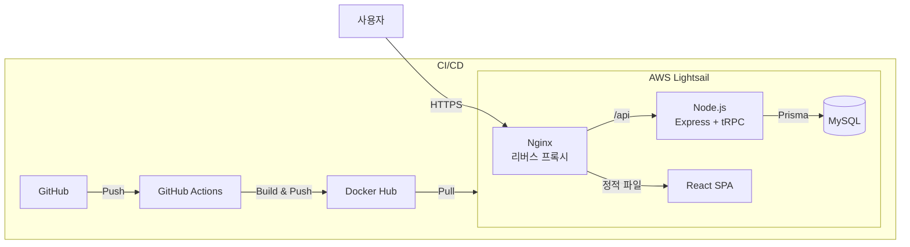
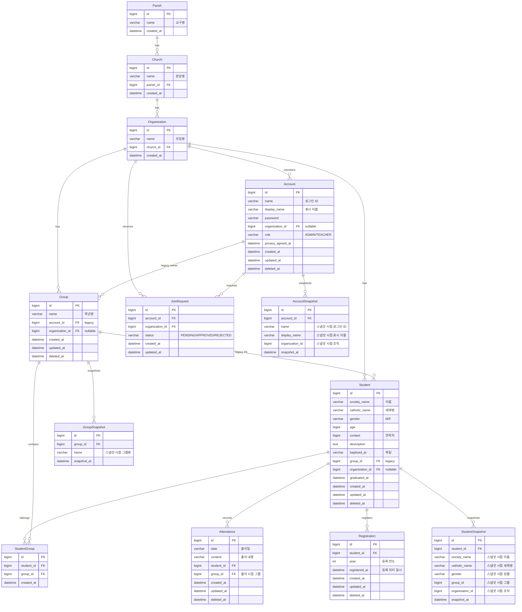

# school-manage program

이 프로젝트는 [기존의 출석부 프로젝트](https://github.com/dc-choi/Attendance)를 보완하기 위해 만든 **주일학교 운영 전반을 돕는 플랫폼**입니다.

## 기술 스택

| 항목      | 기술                             |
|---------|--------------------------------|
| 런타임     | Node.js v24.x                  |
| 패키지 매니저 | pnpm v10.x (모노레포)              |
| 백엔드     | Express 4.22.1 + tRPC          |
| ORM     | Prisma (MySQL)                 |
| 프론트엔드   | Vite + React 19 + Tailwind CSS |
| 테스트     | Vitest                         |

## 문서

| 문서                         | 설명                             |
|----------------------------|--------------------------------|
| `.claude/`                 | Claude Code 설정 (rules, skills) |
| `docs/business/`           | 사업 문서 (문제 정의, BM, GTM, 로드맵 등)  |
| `docs/business/STATUS.md`  | 진행 현황 (현재 목표, 파일럿, 오픈 이슈)     |
| `docs/business/HISTORY.md` | 과거 분석/완료 항목 아카이브              |
| `docs/specs/`              | 제품 명세 (PRD, 기능 설계, SDD)        |
| `docs/guides/`             | 설정 가이드 (GA4 등)                 |

## 제품 기능

| 기능    | 설명                                 |
|-------|------------------------------------|
| 인증    | 로그인, 회원가입, 개인 계정 + 본당/모임 합류       |
| 대시보드  | 출석률, 그룹별 통계, 우수 출석 멤버 현황 (스냅샷 기반 과거 연도 정확한 통계) |
| 모임 관리 | 교구/본당/모임 계층, 합류 요청 승인/거부, 회원 관리   |
| 학년 관리 | 학년 CRUD, 일괄 삭제                     |
| 학생 관리 | 학생 CRUD, 일괄 삭제/복구, 졸업/졸업 취소, 등록 관리 (연도별), 엑셀 Import, 다중 그룹 소속 (N:M) |
| 출석부   | 달력 UI 기반 출석 조회/입력, 종교 일정(부활절 등) 표시 |

## 시스템 아키텍처



## 프로젝트 구조

```
apps/
  api/                    # Express + tRPC API 서버 (@school/api)
    src/
      domains/            # 도메인별 모듈 (UseCase + Router)
      global/             # 공통 (config, errors, middleware)
      infrastructure/     # 외부 연동 (database, logger, scheduler)
    prisma/               # Prisma 스키마 및 마이그레이션
    test/                 # 통합 테스트
  web/                    # Vite + React 웹 앱 (@school/web)
    src/
      components/         # UI 컴포넌트 (common, ui, layout, forms)
      features/           # 도메인별 훅
      pages/              # 페이지 컴포넌트
      routes/             # 라우트 정의
packages/
  trpc/                   # 공유 tRPC 타입/스키마 (@school/trpc)
  utils/                  # 공유 유틸리티 (@school/utils)
docs/
  specs/                  # 제품 명세 (SDD)
  business/               # 사업 문서
```

## ERD



## 개발 히스토리

2022.02 ~ 현재 (운영 중)

| 시기      | 마일스톤                                            |
|---------|-------------------------------------------------|
| 2022.02 | 프로젝트 시작                                         |
| 2022.03 | 첫 배포 (기획한지 2주만에 진행)                              |
| 2025    | 모노레포 전환 (pnpm workspace + Turborepo)            |
| 2026.01 | tRPC + React 19 마이그레이션, Prisma 전환, shadcn/ui 적용 |
| 2026.02 | 랜딩 페이지 구현 (이탈율 81.8% → 12.5%), 다본당 파일럿 확장      |
| 2026.03 | 사용자 데이터 분석, 사업 문서 구조화, 계정 모델 전환 (공유→개인 계정 + 본당/모임 합류) |

## 만들게 된 계기
주일학교 시스템상 매년 아이들의 출석을 기록해야 했고, 그에 따라 기존 엑셀로 된 출석부로는 매년 올해의 토요일, 일요일에 해당되는 부분을 일일히 알아보고 적어야하는 점이 너무 불편했습니다.

또한 출석 관리가 재대로 되지 않는 문제가 있었습니다. 파일을 가지고 있는 한명이 나올 수 없는 경우에는 다른 사람이 출석 체크를 하게되면 재대로 출석관리가 되지 않았습니다.

아이들을 돌보는 것도 힘든 와중에 출석관리까지 매년 따로 신경을 써야하는 점이 너무 번거로웠습니다.

어떻게 해결할 수 있을까? 고민중, 내가 가지고 있는 웹 프로그래밍 지식이라면 중고등부의 시스템을 어느 정도 전산화할 수 있지 않을까? 생각을 하게 되었습니다.

그래서 현 주일학교 시스템 중 하나인 출석부 프로그램을 만들게 되었고, 현재는 주일학교 시스템의 전산화를 목표로 하고 있습니다.

결론적으로 기존의 중고등부의 문제점은 다음과 같습니다.

1. 매년 엑셀로 된 출석부를 다시 만들어야 해서, 아이들의 정보를 다시 입력하고, 새로운 아이들의 정보를 입력하는 데 많은 어려움이 있었습니다.
2. 매년 출석 상을 보상해야 하는데, 기존의 출석부로는 아이들의 출석 통계를 내는 게 어려웠습니다.
3. 엑셀로 된 출석부를 가지고 있지않으면, 출석체크가 불가능합니다.
4. 파일로 관리하기 때문에 각자 가지고있는 출석 현황이 전부 달랐던 문제가 있었습니다.

출석부 프로그램을 제작함으로써, 개선되는 점은 다음과 같습니다.

1. 매년 출석부를 다시 만들지 않아도, 한번만 아이들의 정보를 등록하면 졸업하기 전까지 정보를 계속 유지할 수 있습니다.
2. 출석부 프로그램을 누구나 언제든 출석사항을 기록하고 확인 할 수 있습니다.
3. 회의록을 통해 확인해야하는 출석현황과 다르게 직관적으로 확인이 가능합니다.
4. 출석 상에 대한 통계를 낼때, 간편하게 산출할 수 있습니다.
