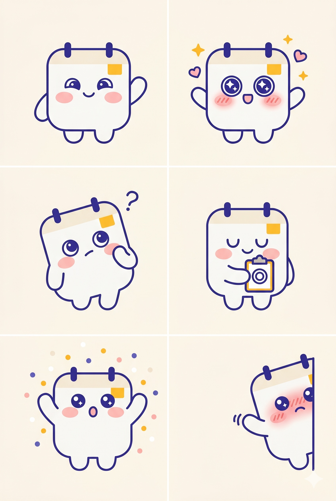

# 위클리스쿨 마스코트 — 주이 (Joo-i)

브랜드 코어와 디자인 키워드는 [README.md](./README.md) 참조.

## 확정 방향 (2026-05-09)

> 
> 정식 레퍼런스: [`assets/joo-i-reference.jpg`](./assets/joo-i-reference.jpg) — 6종 표정 시트

### 캐릭터 정체성

| 항목  | 내용                                                                            |
| ----- | ------------------------------------------------------------------------------- |
| 이름  | **주이 (Joo-i)** — '주(週/主)' + 친근 접미사                                    |
| 정체  | 작은 **벽걸이 달력**이 의인화된 친구. 머리 위 두 개의 바인더 링이 트레이드마크. |
| 한 줄 | "매주 주일, 교실 문 앞에서 출석부를 들고 기다리는 친구"                         |
| 성격  | 차분, 다정, 약간 어설픔, 은근한 유머. 교리교사의 동료 톤                        |
| 말투  | 부드러운 존댓말 ("오늘도 오셨네요", "한 명만 더 체크할까요")                    |

### 시각 디자인 (레퍼런스 기준)

- **실루엣**: 통통한 라운드 사각형 본체 (마시멜로 비율). 머리:몸 ≈ 1.2:1.
- **머리 위**: 작은 **바인더 링 두 개** — 진한 인디고 컬러. **반드시 보존**해야 하는 정체성 요소.
- **상단 띠**: 머리 윗부분에 옅은 베이지 띠(달력의 상단 종이 부분 표현).
- **포인트 스티커**: 우상단에 **작은 amber 사각 메모**(amber `#FBBF24`) — 매 컷 동일하게 유지.
- **얼굴**: 큰 동그란 눈(흰 하이라이트 점), 작은 반달 입(또는 'o' 입), **분홍 볼터치**(Pink `#FBCFE8`).
- **팔다리**: 짧고 통통한 미튼 팔(손가락 없음) + 작은 둥근 발 두 개. 얇지 않게.
- **라인 아트**: 균일한 굵기의 진한 인디고 `#4F46E5` 라인. 단색 면 + 라인 + 액센트.
- **컬러 팔레트**: 본체 크림 `#FAFAF9` / 라인 인디고 `#4F46E5` / 강조 amber `#FBBF24` / 볼터치 핑크 `#FBCFE8`.

### 표정, 포즈 시트 (확정 6종)

레퍼런스 이미지 그대로 라이브러리화. 신규 컷이 필요하면 우선 이 6종 안에서 매칭하고, 부족할 때만 추가 생성.

| #   | 포즈               | 용도                                 |
| --- | ------------------ | ------------------------------------ |
| 1   | 기본 미소, 인사    | 일반 등장, 표지 메인, 인사, 환영     |
| 2   | 반짝 눈 + 별/하트  | 출석 완료, 칭찬, 좋은 소식           |
| 3   | 의문 + ?           | 도움말, FAQ, 질문 던지기             |
| 4   | 클립보드(◎) 안기   | 출석 기록 안내, 주일 저녁 톤         |
| 5   | 양팔 만세 + 색종이 | 이벤트, 축하, 마일스톤               |
| 6   | 모서리 빼꼼        | 짧은 안내, 예고, 공지, 스토리 끝맺음 |

### 이미지 생성 프롬프트 (재현용)

> 톤, 실루엣을 정확히 맞추려면 6종 시트를 한 번에 재생성하는 게 안전. 컷 단위 생성 시 캐릭터 일관성이 흔들릴 수 있음.

```
A 2x3 character expression sheet of a cute Korean kawaii mascot named 주이 (Joo-i) for a Sunday-school attendance app. Keep character design IDENTICAL across all six panels. Soft cream background (#FAFAF9), flat 2D vector illustration, no gradient, no 3D.

Character base (must match in every panel):
- A chubby rounded-square wall-calendar creature, marshmallow-soft proportions.
- Two small dark indigo binder rings on top of the head (the calendar's spiral binding).
- A thin pale beige band across the upper portion of the body (the calendar's top paper strip).
- A small amber yellow square memo sticker (#FBBF24) on the upper-right corner of the body.
- Body: cream white (#FAFAF9), uniform dark indigo line art (#4F46E5), short stubby mitten arms with no fingers, two tiny round feet.
- Face: two large round black eyes with small white sparkle highlights, a small smiling mouth, soft pink blush circles on both cheeks (#FBCFE8).

Six panels (left to right, top to bottom):
1) Default smile — standing, one stubby arm raised waving hello.
2) Sparkle eyes — eyes filled with star sparkles, small amber star and pink heart floating beside the head, both arms slightly raised, extra blush.
3) Curious — head tilted, one stubby paw touching cheek, a small indigo question mark floating above.
4) Sleepy hug — eyes closed in u-shape, gently holding a tiny clipboard with a concentric circle attendance mark (◎) drawn in indigo and amber.
5) Cheering — both arms raised high, mouth in a small round 'o', confetti dots in amber/indigo/pink scattered around.
6) Shy peek — peeking from the right edge of the panel, only half body visible, blushing strongly, one stubby paw waving timidly, tiny sparkle dot.

No religious symbols. No cross, no halo, no church. No text in the image.
```

## 보조 캐릭터 — 축일이 (선택)

- **역할**: 전례력/축일 알림 한정.
- **형태**: 통통한 책갈피 형태. 와인 컬러 `#9F1239` 본체 + 머리 위 골드 리본. 주이와 같은 카와이 톤, 라인.
- **사용 빈도**: 주이 1 : 축일이 0.2 (보조). **메인은 항상 주이.**

```
Companion mascot 축일이: a chubby bookmark-shaped character in soft wine red (#9F1239), tiny gold ribbon tied on top, large round eyes with sparkle highlights, soft pink blush, small smiling mouth. Same kawaii flat vector style and uniform dark indigo line art as 주이. Stands shyly next to 주이. Used only for liturgical-calendar related content. No religious symbols.
```

## 활용 시나리오

| 채널              | 사용                                              |
| ----------------- | ------------------------------------------------- |
| 인스타 4컷 만화   | 주이가 교리교사 옆 1컷 등장 (출석 체크/축일 안내) |
| 인스타 카드뉴스   | 표지, 중간, 마지막에 톤별 컷 1~2회 배치           |
| 인스타 스티커     | 6종 시트를 그대로 스티커 라이브러리로             |
| 빈 상태(UI)       | 학생 없음/출석 없음 화면 — 시안 #1 또는 #3        |
| 온보딩 체크리스트 | 단계 완료 시 시안 #2 또는 #5                      |
| 에러 페이지(404)  | 시안 #3 (의문)                                    |
| OG 이미지         | 로고 + 주이 시안 #1 조합                          |
| 카드뉴스 워터마크 | 우하단에 시안 #6(빼꼼) 작게                       |

## 사용 규칙

### Do

- 항상 **바인더 링 2개 + 상단 베이지 띠 + 우상단 amber 메모**의 3요소를 함께 그린다.
- 라인 굵기, 컬러를 균일하게 유지 (라인 색상은 인디고 고정).
- 6종 표정 시트 안에서 먼저 매칭. 매칭 안 되는 컷만 추가 생성.

### Don't

- 종교 심볼(십자가, 후광, 성배, 로사리오) 일체 금지.
- 사람 모습으로 변형 금지 — 항상 달력-페이지 형태.
- 손가락, 발가락 추가 금지 (미튼/원형 발 유지).
- 안경, 모자, 옷 등 액세서리 임의 추가 금지 (씬 필요 시 별도 결정).
- 흥분/분노/슬픔/울음 등 강한 감정 표정 금지 — 톤 다운된 6종 안에서만 사용.
- 다른 브랜드 IP, 캐릭터와 합성 금지.

## 적용 체크리스트

- [ ] 레퍼런스 6종 → 벡터화 (Figma) → `apps/web/public/mascot/` 추가
- [ ] 빈 상태 UI 도입 검토 (학생 없음 / 출석 없음)
- [ ] 카드뉴스 워터마크 위치 표준화 (우하단 80×80px)
- [ ] 4컷 만화 재개 시 주이를 보조 캐릭터로 통일 적용
- [ ] 인스타 스티커 라이브러리 (6종) 게시
